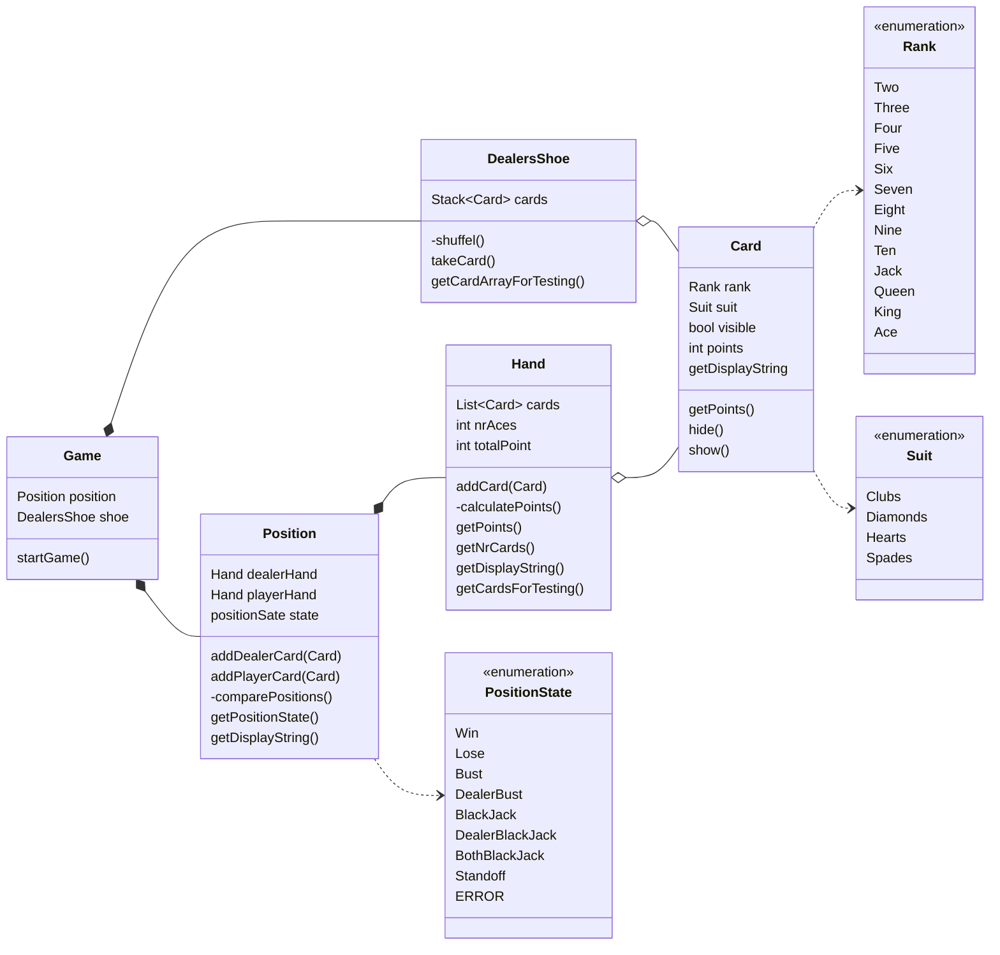

# BlackJack

A console-based Blackjack game written in C# (.NET 10).

## Getting Started

```cmd
dotnet run --project BlackJack
```

## How to Play

Once the game is running, follow the prompts:
- **h** — Hit (draw a card)
- **s** — Stand (end your turn)

The dealer hits on 16 or less and stands on 17 or more. The game detects all standard outcomes: Blackjack, bust, standoff, and win/loss by points.

## Project Structure



```
BlackJack/
├── Card.cs           # Card model (rank, suit, point value, visibility)
├── Hand.cs           # Hand of cards with Ace adjustment logic
├── DealersShoe.cs    # Shuffled deck (52 cards)
├── Position.cs       # Game engine and state machine
├── Game.cs           # UI loop and user input handling
├── Player.cs         # Player model (funds, hands) (For future expansion)
└── Program.cs        # Entry point

BlackJack.nUnitTest/
├── CardTests.cs
├── HandTests.cs
├── DealersShoeTests.cs
├── PositionTest.cs
└── PlayerTests.cs
```

## Rules Implemented

- Aces count as 11, reduced to 1 if the hand would bust
- Blackjack is 21 with exactly 2 cards
- Dealer's second card is hidden until the round ends
- Possible outcomes: Win, Lose, Bust, Dealer Bust, Blackjack, Dealer Blackjack, Both Blackjack, Standoff

## Running Tests

```cmd
dotnet test
```
